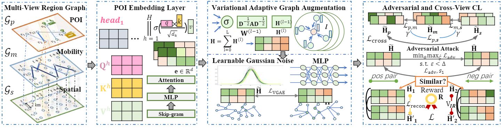
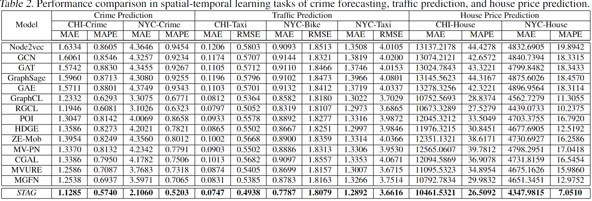

# Spatial-Temporal Graph Learning with Adversarial Contrastive Adaptation #
This is the implementation of Spatial-Temporal Graph Learning with Adversarial Contrastive Adaptation (ICML'23) in the following paper:

## Requirements ##
Pytorch = 1.7.0 and Tensorflow = 1.15.3 (crime prediction task (ST-SHN))

## Data ##
Moblity data, crime data, census block data, POI data, house price of Chicago ([https://data.cityofchicago.org/](https://data.cityofchicago.org/)) and New York([https://opendata.cityofnewyork.us/](https://opendata.cityofnewyork.us/)).
Also, we provide the process data and processing code for data preprocessing.

## Data Preocessing ##
    cd data_pre
    pre_s1.py # collecing positions of 180 (234 regions) in Manhatton (a certain district) in New York (Chicago).
    pre_s2.py # collecting traffic data
    pre_s3.py # preprocessing the traffic data on correspongding regions
    pre_s4.py # preprocessing the POI data and obtain POI-aware Region Graph
    pre_poi_transformer.py # obatining the features of nodes by Transformer and Skip-gram
    pre_spatial_graph.py # constructing the trajectory-based Regoin Graph and Distance-based Region Graph
    pre_s5.py # constructing a hierarical graph
    pre_s6_dataloader.py # obtaining the dataloder (dataset.pt file) for next step to get region embeddings
    cd house
    pre_s7.py # processing house data

## Hyperparameters ##
The dimensionality d of region representation is set as 96 . The depth of convolutional layers in GCN is set as 2. The learning rate is initialized as 0.001 with the weight decay of 1e-5. The number of hidden units is 256. The number of projection hidden is 256. The eps is set as 0.5. And alpha is set as.1, beta is set as 0.1; the lamb is set as 0.05. For the crime prediction backbone model, ST-SHN is configured with the learning rate of 0.001 and the weight decay of 0.96. The depth of the spatial path aggregation layers is set as 2. For the traffic prediction backbone model ST-GCN, the historical time window of all tests are set as 60 minutes with 12 observed data points that are utilized to forecast traffic conditions in the next 15, 30, 45 minutes. The baselines are implemented with the source code released by their original papers. We further apply the grid search strategy for parameter tuning in baselines to achieve their best performance. 

## Spatial-Temporal Adversarial Graph Model (STAG) Training and Obtaining Region Representations ##
    train_edit_auto.py   # training for obatining region representations

## TASK 1: Crime Prediction Task ##
The code of the ST-SHN is [https://github.com/akaxlh/ST-SHN](https://github.com/akaxlh/ST-SHN)

Replace the area embedding with the region represenation vetcor and run `HG_ST_labcode.py`.

## TASK 2:  Traffic Prediction Task ##
The code of the ST-GCN is [https://github.com/VeritasYin/STGCN_IJCAI-18](https://github.com/VeritasYin/STGCN_IJCAI-18)
ST-GCN predicts traffic in one stage, namely 15 minutes.
Run `main.py`.

## TASK 3: House Prediction Prediction Task ##
We use Lasso Regression to perform house price evaluation task.

Just `cd house` and run `pre_s9.py` and got the regression result.

## Citing ##
If our paper benefits to your research, please cite our paper using the bitex below:

    @inproceedings{zhang2023spatial,
      title={Spatial-Temporal Graph Learning with Adversarial Contrastive Adaptation},
      author={Zhang, Qianru and Huang, Chao and Xia, Lianghao and Wang, Zheng and Yiu, Siu Ming and Han, Ruihua},
      booktitle={International Conference on Machine Learning},
      pages={41151--41163},
      year={2023},
      organization={PMLR}
}
